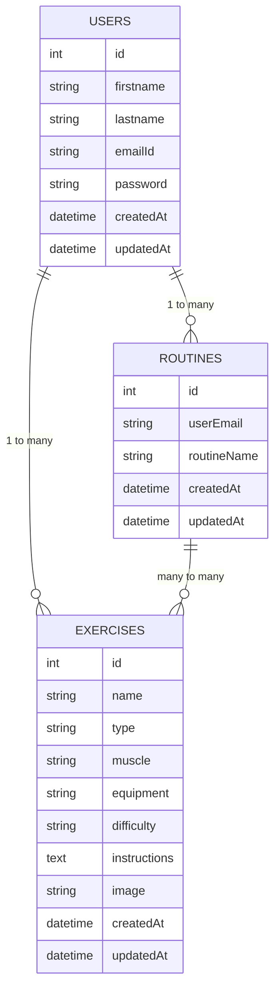

<!-- @format -->

```mermaid
erDiagram
    USERS ||--o{ ROUTINES : "1 to many"
    USERS ||--o{ EXERCISES : "1 to many"
    ROUTINES ||--o{ EXERCISES : "many to many"
    USERS {
        int id
        string firstname
        string lastname
        string emailId
        string password
        datetime createdAt
        datetime updatedAt
    }
    ROUTINES {
        int id
        string userEmail
        string routineName
        datetime createdAt
        datetime updatedAt
    }
    EXERCISES {
        int id
        string name
        string type
        string muscle
        string equipment
        string difficulty
        text instructions
        string image
        datetime createdAt
        datetime updatedAt
    }
```
